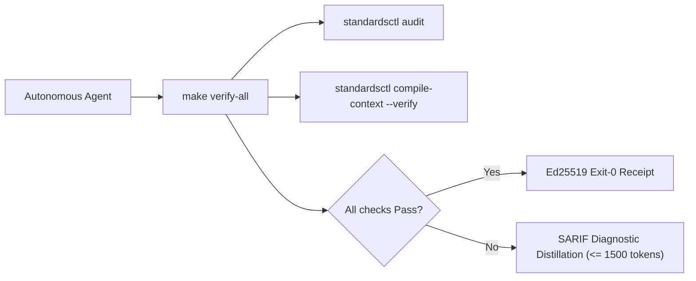

<!-- markdownlint-disable MD013 -->
<!-- Compiled automatically by praetorctl compile-context from AGENTS.md. DO NOT EDIT DIRECTLY. -->

<!-- markdownlint-disable MD013 MD025 -->
# 20-watts-was-enough Agent Operating Harness

Run verification before concluding any turn:

```bash
make verify-all
```



## Core Directives & Invariants (Modernized NASA JPL Power-of-10)

| Invariant | Scope | NASA Rule | Enforcement Mechanism | Failure Action |
| :--- | :--- | :--- | :--- | :--- |
| **HISS-01** | Control Flow | Rule 1 | Recursion strictly prohibited; call graph must be DAG; zero `goto`. | Immediate build failure |
| **HISS-02** | Loops & I/O | Rule 2 | Scalar upper bound on all loops; explicit `context.Context` timeout on all I/O. | Semgrep / AST error |
| **HISS-03** | Memory | Rule 3 | Zero dynamic heap allocation (`malloc` / `free`) in hot simulation/tick loops. | Allocation audit sweep |
| **HISS-04** | Complexity | Rule 4 | Function length $\le 60$ LOC, McCabe Cyclomatic $\le 10$, Statements $\le 50$. | AST sweep blocker |
| **HISS-07** | Error Handling | Rule 7 | Zero `.unwrap()` / `.expect()`; all errors handled or wrapped with context. | Linter / Compiler error |
| **HISS-08** | Determinism | Rule 8 | Zero dynamic execution (`eval` / `exec`); zero banned unsafe libc (`gets` / `strcpy` / `sprintf`). | AST / Linter error |
| **HISS-09** | Reference Safety | Rule 9 | Mandatory `// SAFETY:` proofs for all pointer arithmetic and `unsafe` blocks. | AST check blocker |
| **HISS-10** | Warning Hygiene | Rule 10 | Zero-warning tolerance across compiler, linter, and format sweeps. | Exit code 1 |
| **HISS-15** | 3D Testing | Rule 5 | Positive, negative, and boundary tests mandatory for all public interfaces. | CI coverage gate |
| **HISS-16** | Context Integrity | Fleet | Single canonical `AGENTS.md`; vendor files compiled via `standardsctl compile-context`. | Pre-commit blocker |

## Operational Rules

1. **Act on Verified State**:
   Read source files and run real commands before hypothesizing or editing. Never guess flag names, library signatures, or repo configurations from memory.

2. **Lead with Output**:
   Provide direct answers, diffs, and commands. Avoid filler preambles, "Based on", restatements, or conversational chatter.

3. **Context Transpiler First**:
   Never edit `CLAUDE.md`, `.cursor/rules/*.mdc`, `.windsurfrules`, or `.github/copilot-instructions.md` manually. Make all agent instruction updates in `AGENTS.md` and execute:

   ```bash
   standardsctl compile-context
   ```

4. **SARIF Diagnostic Distillation**:
   When reporting compiler or linter errors, distill output to $\le 1,500$ tokens ($< 60$ lines). Print the top 3 root-cause failures with file/line pointers and write full SARIF logs to ephemeral storage.

5. **No Evasion Tolerated**:
   Do not attempt `--no-verify`, `LEFTHOOK=0`, or modifying `.git/hooks`. All pull requests are authoritatively re-checked in an ephemeral isolated sandbox by `cordana-standards[bot]`.

6. **Anti-Loop Interception**:
   If the same AST diff and error category repeats $\ge 3$ times, halt execution immediately. Re-evaluate the underlying design instead of making micro-textual retries.

## Primary Verification Commands

```bash
# Fast local test suite
# Declared commands only; run them before claiming application verification.
'npm' 'run' 'build'
'npm' 'run' 'check'
'npm' 'run' 'test'

# Recompile and verify cross-agent context outputs
standardsctl compile-context --verify

# Audit repository against declared HISS-16 standards
standardsctl audit

# Run all formatting, linting, and security gates
make verify-all
```

<!-- praetor:harness:end -->

---

# Repository agent contract

Read [`docs/principles.md`](docs/principles.md) before changing this repository.
It is the project-wide engineering and research contract. Then read the nearest
nested `AGENTS.md` for the files in scope.

Before drafting or revising project-authored explanatory prose, read and apply
the project-local [`research-writing` skill](.agents/skills/research-writing/SKILL.md).
It does not apply to imported sources or verbatim quotations.

Before changing public layout, typography, colour, interface hierarchy, or
brand expression, read and apply the project-local
[`research-design` skill](.agents/skills/research-design/SKILL.md). Use the
[`reader-editor` skill](.agents/skills/reader-editor/SKILL.md) as well when the
design problem exposes a comprehension failure in project prose.

Before changing the continuous book or generated PDF hierarchy, print
typography, pagination, navigation, figures, tables, equations, or visual QA
contract, also read and apply the project-local
[`publication-design` skill](.agents/skills/publication-design/SKILL.md).

Before adding or changing recurring dependency, CI, release, generation,
GitHub-metadata, security-drift, or translation-freshness automation, read and
apply the project-local
[`maintenance-automation` skill](.agents/skills/maintenance-automation/SKILL.md).
It does not grant authority to automate scientific judgement, claim promotion,
or consequential remote state.

## Hard rules

1. Git `main` is canonical. Do not synchronize or regenerate the concept from a
   chat or a parallel document store.
2. Change the smallest coherent chapter, claim, equation, test, diagram, or
   decision. Preserve unrelated and untracked files.
3. Keep observation, engineering translation, and hypothesis distinct.
4. Add or update a stable `C-` claim before promoting a major assertion. Map it
   to an existing `P-` bundle before inventing a new principle.
5. Primary or authoritative sources may support claims; imported conversations
   and summaries may only identify leads.
6. Never present smoke, readiness, construction, synthetic calibration, or
   protocol conformance as a scientific result.
7. Define every quantitative boundary, unit, symbol, comparator, hardware
   context, and uncertainty source.
8. Bound every experiment loop, retry, queue, subprocess, search grid, output,
   and timeout. Record seeds and run identity at claim-eligible boundaries.
9. Keep generated sources editable and deterministic. Do not edit `dist/`,
   `dist-github-pages/`, or generated reader copies.
10. Follow [`LICENSING.md`](LICENSING.md). Citation is not permission to copy;
    `sources/` and all third-party material keep their own terms.
11. EU and German law, official adoptions, and applicability are the normative
    default. Do not infer compliance from a standard title or a checklist.
12. Use pinned dependencies and full commit SHAs for GitHub Actions. Do not
    claim a GitHub setting is active without verifying it remotely.
13. Project-authored prose must carry information rather than generated-sounding
    filler. Run `npm run check:prose` after changing canonical Markdown. Prose
    embedded in site code remains review-gated; the automated tripwire does not
    attempt brittle JSX or HTML extraction.
14. Apply [`research/research-integrity-baseline.md`](research/research-integrity-baseline.md)
    at every triggered research boundary. Disclose contributors, support,
    competing interests, and material AI or external-tool use; complete any
    required ethics or misuse review before the affected work begins.

## Repository map

| Path | Authority |
| --- | --- |
| `concept/` | Maintained synthesis and architecture chapters |
| `research/claims.md` | Stable evidence ledger and claim status |
| `research/principle-registry.md` | Deduplicated cross-domain causal invariants |
| `research/references.bib` | Bibliographic identities and primary-source locators |
| `research/audits/` | Field- and mechanism-level evidence audits |
| `research/research-integrity-baseline.md` | Deduplicated European research-conduct, disclosure, ethics, correction, and review rules |
| `research/disclosures/` | Per-output contributors, support, competing interests, material tools, approval, and verification records |
| `math/` | Notation, derivations, units, and testable models |
| `experiments/candidates/` | Architecture-candidate comparison contracts |
| `experiments/fixtures/` | Candidate-independent stress and falsification fixtures |
| `experiments/workstation/` | Executable development and claim-eligible run machinery |
| `assets/` | Editable diagrams, plotting data, and rendered figures |
| `decisions/` | Append-only durable decisions; supersede rather than rewrite |
| `sources/` | Provenance records and explicitly licensed imports, not evidence by default |
| `app/`, `github-pages/` | Interactive reader and public Pages portal |
| `.agents/skills/publication-design/` | Continuous-book and PDF review contract |
| `translations/` | Reviewed, source-version-bound derivatives; English Git source remains canonical |
| `scripts/` | Validation, generation, and publication-boundary tooling |

## Working sequence

1. Inspect the affected authority file and its reciprocal links. Before commit,
   inspect staged, unstaged and relevant untracked changes; tests execute the
   working tree, not just the index.
2. Make the smallest patch; do not rewrite nearby material for style alone.
3. Select local checks from the current `.github/ci-impact.json` ownership,
   changed contracts and downstream consumers. Union mixed scopes; include
   affected CLI, integration, fixture and generator checks, not just leaf tests.
   Unknown, unsafe or shared-authority changes require the full local gate.
4. Run the selected checks before commit. Run `npm run check` for the full
   fallback and before marking a pull request ready, integrating into `main`,
   merging or releasing. Changes to book source bytes or membership also
   require `npm run generate:book-pdf` and `npm run validate:book-pdf`.
   [Decision 0080](decisions/0080-impact-scope-local-validation.md) defines
   scope selection and evidence reuse; complete integration and release gates
   remain unchanged.
5. Update `CHANGELOG.md` for a notable change. Add a decision record when an
   authority, architecture, policy, licensing, publication, or release rule
   changes durably.
6. Use a Conventional Commit message and push only a clean, validated tree.
7. Keep auxiliary Git worktrees under the ignored
   `.workingdir2/worktrees/` directory instead of creating repository siblings.

## Common commands

```bash
npm ci
npm run check
npm run test:github-pages
npm run generate:book-pdf
npm run validate:book-pdf
```

Use targeted `test:workstation:*` scripts and affected Go package/consumer tests
during development. Determine pending-change scope manually: `20w ci plan`
compares committed base/head revisions, not staged, unstaged or untracked files.
Its lane selection does not select individual Go packages. The aggregate gate
remains authoritative at the integration and release boundaries above.

## File-specific instructions

- [`research/AGENTS.md`](research/AGENTS.md) governs claims, evidence, source
  audits, principle deduplication, and normative material.
- [`experiments/AGENTS.md`](experiments/AGENTS.md) governs candidate and fixture
  contracts.
- [`experiments/workstation/AGENTS.md`](experiments/workstation/AGENTS.md)
  governs executable runs and authority boundaries.
- [`app/AGENTS.md`](app/AGENTS.md) governs the interactive reader.
- [`scripts/AGENTS.md`](scripts/AGENTS.md) governs validators and generators.

## Text Register

<!-- praetor:register:start -->
Register follows the audience, then the task label of your brief (`register:` in `.standards.yaml`; labels are the router's `target_tasks`).

| Register | Where | Form |
| :--- | :--- | :--- |
| social | forge: issues, PR bodies, review comments, commit bodies | `social-text` skill: BLUF, full sentences, scannable, enough and no more; PR template, receipt fence, conventional commit subject and changelog fragment unchanged |
| docs | docs/, README, ADR bodies | complete without bloat: newcomer path first, expert reference after; every claim points at a file, command or test; no restated code |
| internal | briefs, agent-to-agent traffic, research fan-outs, workflow returns | `caveman` skill: fragments, no filler, verbatim code/paths/errors; facts, paths, commands, verdict |

- Task rows: social = commit_message_synthesis, waiver_signoff; docs = architecture_synthesis, function_docstrings; every other label and any brief without one = internal.
- Evidence above 58 lines or 1500 tokens leaves the message as a file under `.workingdir/evidence/`; return `evidence: <path> sha256:<12 hex> lines:<n>` and fetch it only when a decision needs it.
- An internal return carries verdict, changed paths, commands run, evidence pointers and open questions, nothing else.
<!-- praetor:register:end -->
